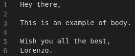

# Call For Paper Invitation Bot


While the management of special issues, workshop and conferences becomes more complex, automatic tools come to the rescue. This project includes a simple command line program to send email via Google API. Suggestions and bug reports are always welcome. If you have any question, request or suggestion, please enter it in the Issues with appropriate label.


## Get Google Credendials
Follow the instructions [here](https://developers.google.com/gmail/api/quickstart/python) to download the credential JSON file required to run the *c4pinvitation-email-bot*.

## How to build it
Download latest release [here]() and make up the virtual environment.

```bash
virtualenv -p python3 venv
source venv/bin/activate
pip install -r requirements.txt
```

## How to use it
The application strongly requires a list of recipients, the email subject and the body. The list of carbon copy recipients is instead optional. These parameters must be stored within independent files as follow.

<p align="center">
  
  <br>
  <em>Example of emails to</em>
  <br> <br>
  
  <br>
  <em>Example of emails body</em>
</p>

Run then the application as follow.

```bash
python main.py \
    --to <PATH/OF/TO-FILE> \
    --subject "try it out" \
    --body <PATH/OF/BODY-FILE>
```